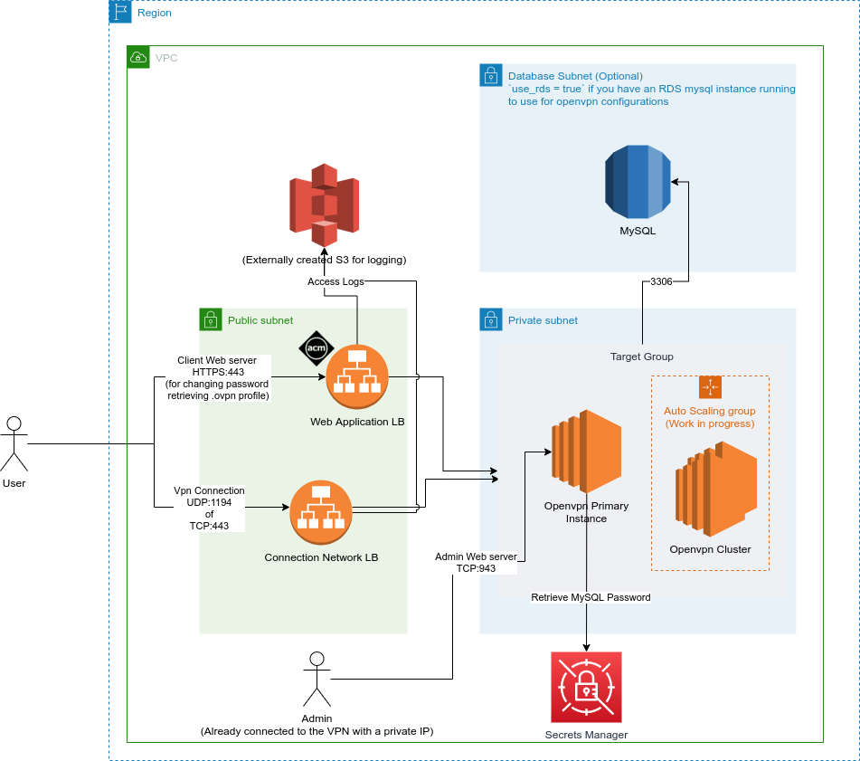

# OpenVPN

This module setups an openvpn server with 2 load balancers, 1 for user logins for retrieval or profile, and 1 for vpn client connection and admin access

## Design



## Usage

```
module "ovpn"{
  name = "my-openvpn"

  openvpn_hostname          = "example-connection.com"
  openvpn_pool_ip           = "172.40.200.0/22"
  openvpn_ami_id            = "ami-xxx" # From your openvpn marketplace subscription
  domain_name               = "example.com"
  route53_zone_id           = "xx" # For ACM creation
  vpc_id                    = "vpc-xx"
  s3_bucket_access_logs     = "my-bucket"
  public_subnet_ids         = ["subnet-xxx"]
  private_subnet_ids        = ["subnet-yyy"]
  key_name                  = "my-ssh-key-pair"

  # Your VPC cidr for clients to access private network
  vpn_private_network_cidrs = [
    "172.111.111.0/22"
  ]
}
```

## Notes

### Use RDS

#### Requirements

1. RDS MySQL setup separately
2. RDS username and password in secrets manager with the following key/values
   1. username
   2. password

If you wish to use RDS with this module for backing up your openvpn settings remotely, please note the following

1. certain variables will cause a change in user-data script, this will cause a recreation of your EC2 primary server instance. If you have yet to be connected to the RDS succesfully, this will result in a loss of your current settings (Please see [here](https://openvpn.net/vpn-server-resources/configuration-database-management-and-backups/#change-database-backend-to-mysql-or-amazon-rds) if you are migrating from a local sqlite to rds mysql)
2. When using RDS, a custom user data script will be ran, do take a look at the [template](./vm_openvpn.tpl) before using it to see if it fits your needs
3. This module does not set your linux admin user password as that is not a safe practice. Therefore on initial setup, you have to ssh in to set the admin password before you can manage via the admin web server. Run `passwd openvpn` to set your password in the server

### Autoscaling cluster

## Requirements

No requirements.

## Providers

| Name | Version |
|------|---------|
| <a name="provider_aws"></a> [aws](#provider\_aws) | n/a |
| <a name="provider_template"></a> [template](#provider\_template) | n/a |

## Modules

No modules.

## Resources

| Name | Type |
|------|------|
| [aws_acm_certificate.cert](https://registry.terraform.io/providers/hashicorp/aws/latest/docs/resources/acm_certificate) | resource |
| [aws_acm_certificate_validation.cert](https://registry.terraform.io/providers/hashicorp/aws/latest/docs/resources/acm_certificate_validation) | resource |
| [aws_autoscaling_group.ovpn-ext-asg](https://registry.terraform.io/providers/hashicorp/aws/latest/docs/resources/autoscaling_group) | resource |
| [aws_iam_instance_profile.openvpn-ec2-profile](https://registry.terraform.io/providers/hashicorp/aws/latest/docs/resources/iam_instance_profile) | resource |
| [aws_iam_role.openvpn](https://registry.terraform.io/providers/hashicorp/aws/latest/docs/resources/iam_role) | resource |
| [aws_instance.primary](https://registry.terraform.io/providers/hashicorp/aws/latest/docs/resources/instance) | resource |
| [aws_launch_configuration.ovpn-launch](https://registry.terraform.io/providers/hashicorp/aws/latest/docs/resources/launch_configuration) | resource |
| [aws_lb.connection](https://registry.terraform.io/providers/hashicorp/aws/latest/docs/resources/lb) | resource |
| [aws_lb.web](https://registry.terraform.io/providers/hashicorp/aws/latest/docs/resources/lb) | resource |
| [aws_lb_listener.connection](https://registry.terraform.io/providers/hashicorp/aws/latest/docs/resources/lb_listener) | resource |
| [aws_lb_listener.connection-admin](https://registry.terraform.io/providers/hashicorp/aws/latest/docs/resources/lb_listener) | resource |
| [aws_lb_listener.connection-udp](https://registry.terraform.io/providers/hashicorp/aws/latest/docs/resources/lb_listener) | resource |
| [aws_lb_listener.web-front-end](https://registry.terraform.io/providers/hashicorp/aws/latest/docs/resources/lb_listener) | resource |
| [aws_lb_target_group.conn-admin-to-ec2](https://registry.terraform.io/providers/hashicorp/aws/latest/docs/resources/lb_target_group) | resource |
| [aws_lb_target_group.conn-to-ec2](https://registry.terraform.io/providers/hashicorp/aws/latest/docs/resources/lb_target_group) | resource |
| [aws_lb_target_group.conn-to-ec2-udp](https://registry.terraform.io/providers/hashicorp/aws/latest/docs/resources/lb_target_group) | resource |
| [aws_lb_target_group.web-to-ec2](https://registry.terraform.io/providers/hashicorp/aws/latest/docs/resources/lb_target_group) | resource |
| [aws_lb_target_group_attachment.primary-conn](https://registry.terraform.io/providers/hashicorp/aws/latest/docs/resources/lb_target_group_attachment) | resource |
| [aws_lb_target_group_attachment.primary-conn-admin](https://registry.terraform.io/providers/hashicorp/aws/latest/docs/resources/lb_target_group_attachment) | resource |
| [aws_lb_target_group_attachment.primary-conn-udp](https://registry.terraform.io/providers/hashicorp/aws/latest/docs/resources/lb_target_group_attachment) | resource |
| [aws_lb_target_group_attachment.primary-web](https://registry.terraform.io/providers/hashicorp/aws/latest/docs/resources/lb_target_group_attachment) | resource |
| [aws_network_acl_rule.allow-udp-connection](https://registry.terraform.io/providers/hashicorp/aws/latest/docs/resources/network_acl_rule) | resource |
| [aws_network_acl_rule.allow-udp-connection-egress](https://registry.terraform.io/providers/hashicorp/aws/latest/docs/resources/network_acl_rule) | resource |
| [aws_route53_record.conn](https://registry.terraform.io/providers/hashicorp/aws/latest/docs/resources/route53_record) | resource |
| [aws_route53_record.openvpn](https://registry.terraform.io/providers/hashicorp/aws/latest/docs/resources/route53_record) | resource |
| [aws_route53_record.web](https://registry.terraform.io/providers/hashicorp/aws/latest/docs/resources/route53_record) | resource |
| [aws_security_group.ec2](https://registry.terraform.io/providers/hashicorp/aws/latest/docs/resources/security_group) | resource |
| [aws_security_group.openvpn-conn](https://registry.terraform.io/providers/hashicorp/aws/latest/docs/resources/security_group) | resource |
| [aws_security_group.openvpn-web](https://registry.terraform.io/providers/hashicorp/aws/latest/docs/resources/security_group) | resource |
| [aws_security_group_rule.allow-1194-to-ec2](https://registry.terraform.io/providers/hashicorp/aws/latest/docs/resources/security_group_rule) | resource |
| [aws_security_group_rule.allow-943-from-cidr](https://registry.terraform.io/providers/hashicorp/aws/latest/docs/resources/security_group_rule) | resource |
| [aws_security_group_rule.allow-conn-to-ec2](https://registry.terraform.io/providers/hashicorp/aws/latest/docs/resources/security_group_rule) | resource |
| [aws_security_group_rule.allow-from-elb](https://registry.terraform.io/providers/hashicorp/aws/latest/docs/resources/security_group_rule) | resource |
| [aws_security_group_rule.allow-individual-1194-to-ec2](https://registry.terraform.io/providers/hashicorp/aws/latest/docs/resources/security_group_rule) | resource |
| [aws_security_group_rule.allow-outbound](https://registry.terraform.io/providers/hashicorp/aws/latest/docs/resources/security_group_rule) | resource |
| [aws_security_group_rule.allow-ssh](https://registry.terraform.io/providers/hashicorp/aws/latest/docs/resources/security_group_rule) | resource |
| [aws_security_group_rule.allow-web-internal](https://registry.terraform.io/providers/hashicorp/aws/latest/docs/resources/security_group_rule) | resource |
| [aws_security_group_rule.conn-egress](https://registry.terraform.io/providers/hashicorp/aws/latest/docs/resources/security_group_rule) | resource |
| [aws_security_group_rule.conn-ingress-individual](https://registry.terraform.io/providers/hashicorp/aws/latest/docs/resources/security_group_rule) | resource |
| [aws_security_group_rule.conn-ingress-public](https://registry.terraform.io/providers/hashicorp/aws/latest/docs/resources/security_group_rule) | resource |
| [aws_security_group_rule.web-egress](https://registry.terraform.io/providers/hashicorp/aws/latest/docs/resources/security_group_rule) | resource |
| [aws_security_group_rule.web-ingress-individual-443](https://registry.terraform.io/providers/hashicorp/aws/latest/docs/resources/security_group_rule) | resource |
| [aws_security_group_rule.web-ingress-individual-80](https://registry.terraform.io/providers/hashicorp/aws/latest/docs/resources/security_group_rule) | resource |
| [aws_security_group_rule.web-ingress-public-443](https://registry.terraform.io/providers/hashicorp/aws/latest/docs/resources/security_group_rule) | resource |
| [aws_security_group_rule.web-ingress-public-80](https://registry.terraform.io/providers/hashicorp/aws/latest/docs/resources/security_group_rule) | resource |
| [template_file.ovpn_ext_tpl_primary](https://registry.terraform.io/providers/hashicorp/template/latest/docs/data-sources/file) | data source |
| [template_file.ovpn_ext_tpl_secondary](https://registry.terraform.io/providers/hashicorp/template/latest/docs/data-sources/file) | data source |

## Inputs

| Name | Description | Type | Default | Required |
|------|-------------|------|---------|:--------:|
| <a name="input_admin_allowed_ips"></a> [admin\_allowed\_ips](#input\_admin\_allowed\_ips) | Map of User and IP for tcp admin\_port admin web | <pre>map(object({<br>    name    = string,<br>    ip_addr = set(string)<br>  }))</pre> | `{}` | no |
| <a name="input_admin_port"></a> [admin\_port](#input\_admin\_port) | Port number which openvpn admin website wil be hosted on | `number` | `943` | no |
| <a name="input_aws_region"></a> [aws\_region](#input\_aws\_region) | AWS region. | `string` | `"ap-southeast-1"` | no |
| <a name="input_conn_allow_public"></a> [conn\_allow\_public](#input\_conn\_allow\_public) | Allow public vpn clients to connect to the vpn server? | `bool` | `true` | no |
| <a name="input_conn_allowed_ips"></a> [conn\_allowed\_ips](#input\_conn\_allowed\_ips) | Map of User and IP for openvpn connection | <pre>map(object({<br>    name    = string,<br>    ip_addr = set(string)<br>  }))</pre> | `{}` | no |
| <a name="input_conn_port"></a> [conn\_port](#input\_conn\_port) | Port number which openvpn clients will use to establish a vpn connection to the server with, 1-65535 | `number` | `1194` | no |
| <a name="input_domain_name"></a> [domain\_name](#input\_domain\_name) | domain name to serve site on | `string` | n/a | yes |
| <a name="input_extra_iam_policy_arns"></a> [extra\_iam\_policy\_arns](#input\_extra\_iam\_policy\_arns) | Extra IAM policies to include (e.g cloudwatch, session manager) | `list(string)` | `[]` | no |
| <a name="input_key_name"></a> [key\_name](#input\_key\_name) | SSH Key pair name | `string` | `""` | no |
| <a name="input_nacl_udp_port_allow_list"></a> [nacl\_udp\_port\_allow\_list](#input\_nacl\_udp\_port\_allow\_list) | Creating NACL rules for openvpn UDP connection | <pre>map(object({<br>    nacl_id     = string,<br>    rule_number = number<br>  }))</pre> | `{}` | no |
| <a name="input_name"></a> [name](#input\_name) | Name prefix for various resources created | `string` | n/a | yes |
| <a name="input_openvpn_ami_id"></a> [openvpn\_ami\_id](#input\_openvpn\_ami\_id) | Openvpn AMI id from marketplace subscription | `string` | n/a | yes |
| <a name="input_openvpn_hostname"></a> [openvpn\_hostname](#input\_openvpn\_hostname) | openvpn connection url, different from the web url | `string` | n/a | yes |
| <a name="input_openvpn_pool_ip"></a> [openvpn\_pool\_ip](#input\_openvpn\_pool\_ip) | IP Pool range for clients | `string` | `"172.27.200.0/22"` | no |
| <a name="input_openvpn_secret_manager_credentials_arn"></a> [openvpn\_secret\_manager\_credentials\_arn](#input\_openvpn\_secret\_manager\_credentials\_arn) | ARN of AWS Secret Manager secret that contains ths password to use for openvpn admin user | `string` | `""` | no |
| <a name="input_permissions_boundary"></a> [permissions\_boundary](#input\_permissions\_boundary) | Permissions boundary that will be added to the created roles. | `string` | `null` | no |
| <a name="input_private_subnet_ids"></a> [private\_subnet\_ids](#input\_private\_subnet\_ids) | List of private subnet ids for launch configuration to create ec2 instances in | `list(string)` | n/a | yes |
| <a name="input_public_subnet_ids"></a> [public\_subnet\_ids](#input\_public\_subnet\_ids) | List of public subnet ids for elastic load balancer | `list(string)` | n/a | yes |
| <a name="input_rds_fqdn"></a> [rds\_fqdn](#input\_rds\_fqdn) | Hostname of RDS | `string` | `""` | no |
| <a name="input_rds_secret_manager_credentials_arn"></a> [rds\_secret\_manager\_credentials\_arn](#input\_rds\_secret\_manager\_credentials\_arn) | ARN of AWS Secret Manager secret that contains ths password to use to connect to RDS with | `string` | `""` | no |
| <a name="input_rds_secret_manager_id"></a> [rds\_secret\_manager\_id](#input\_rds\_secret\_manager\_id) | Path of AWS Secret Manager secret that contains ths password to use to connect to RDS with | `string` | `""` | no |
| <a name="input_route53_zone_id"></a> [route53\_zone\_id](#input\_route53\_zone\_id) | Route53 Zone ID | `string` | `""` | no |
| <a name="input_s3_bucket_access_logs"></a> [s3\_bucket\_access\_logs](#input\_s3\_bucket\_access\_logs) | S3 bucket for storing access logs | `string` | n/a | yes |
| <a name="input_s3_prefix"></a> [s3\_prefix](#input\_s3\_prefix) | Prefix for access logs if you want to change the object folder. remember to add a prevailing '/' e.g 'nlb/ | `string` | `""` | no |
| <a name="input_ssh_allowed_ips"></a> [ssh\_allowed\_ips](#input\_ssh\_allowed\_ips) | Map of User and IP for ssh | <pre>map(object({<br>    name    = string,<br>    ip_addr = set(string)<br>  }))</pre> | n/a | yes |
| <a name="input_tags"></a> [tags](#input\_tags) | Tags to include | `map` | `{}` | no |
| <a name="input_use_rds"></a> [use\_rds](#input\_use\_rds) | Toggle to use RDS or local sqlite db | `bool` | `false` | no |
| <a name="input_vpc_id"></a> [vpc\_id](#input\_vpc\_id) | VPC ID | `string` | n/a | yes |
| <a name="input_vpn_private_network_cidrs"></a> [vpn\_private\_network\_cidrs](#input\_vpn\_private\_network\_cidrs) | Private network cidr which clients will be able to access, typically your VPC cidr | `list(string)` | `[]` | no |
| <a name="input_web_allow_public"></a> [web\_allow\_public](#input\_web\_allow\_public) | Allow public to access the web UI? | `bool` | `true` | no |
| <a name="input_web_allowed_ips"></a> [web\_allowed\_ips](#input\_web\_allowed\_ips) | Map of User and IP for tcp 443 web | <pre>map(object({<br>    name    = string,<br>    ip_addr = set(string)<br>  }))</pre> | `{}` | no |
| <a name="input_web_port"></a> [web\_port](#input\_web\_port) | Port number which openvpn website wil be hosted on | `number` | `443` | no |

## Outputs

| Name | Description |
|------|-------------|
| <a name="output_acm_arn"></a> [acm\_arn](#output\_acm\_arn) | n/a |
| <a name="output_acm_domain_name"></a> [acm\_domain\_name](#output\_acm\_domain\_name) | n/a |
| <a name="output_asg_arn"></a> [asg\_arn](#output\_asg\_arn) | n/a |
| <a name="output_aws_lb_connection_arn"></a> [aws\_lb\_connection\_arn](#output\_aws\_lb\_connection\_arn) | n/a |
| <a name="output_aws_lb_connection_dns"></a> [aws\_lb\_connection\_dns](#output\_aws\_lb\_connection\_dns) | n/a |
| <a name="output_aws_lb_web_arn"></a> [aws\_lb\_web\_arn](#output\_aws\_lb\_web\_arn) | n/a |
| <a name="output_aws_lb_web_dns"></a> [aws\_lb\_web\_dns](#output\_aws\_lb\_web\_dns) | n/a |
| <a name="output_instance_primary_arn"></a> [instance\_primary\_arn](#output\_instance\_primary\_arn) | n/a |
| <a name="output_instance_profile_arn"></a> [instance\_profile\_arn](#output\_instance\_profile\_arn) | n/a |
| <a name="output_instance_root_block_id"></a> [instance\_root\_block\_id](#output\_instance\_root\_block\_id) | n/a |
| <a name="output_launch_configuration_arn"></a> [launch\_configuration\_arn](#output\_launch\_configuration\_arn) | n/a |
| <a name="output_security_group_id_connection"></a> [security\_group\_id\_connection](#output\_security\_group\_id\_connection) | n/a |
| <a name="output_security_group_id_ec2"></a> [security\_group\_id\_ec2](#output\_security\_group\_id\_ec2) | n/a |
| <a name="output_security_group_id_web"></a> [security\_group\_id\_web](#output\_security\_group\_id\_web) | n/a |
